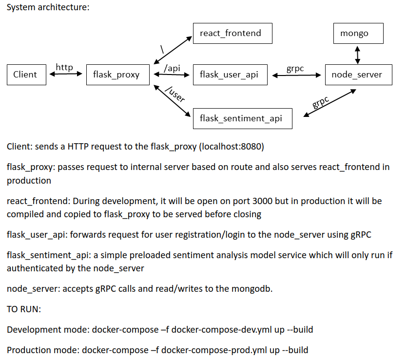

Google's Remote Procedure Call (gRPC) is a high performance way of sending data between different microservices.
They do this by using protocol buffers to serialize data allowing them to be sent and read by different problems regardless of language.

This is an attempt to create a microservice architechture that can utilize gRPC protocol.
# GRPC-microservices

